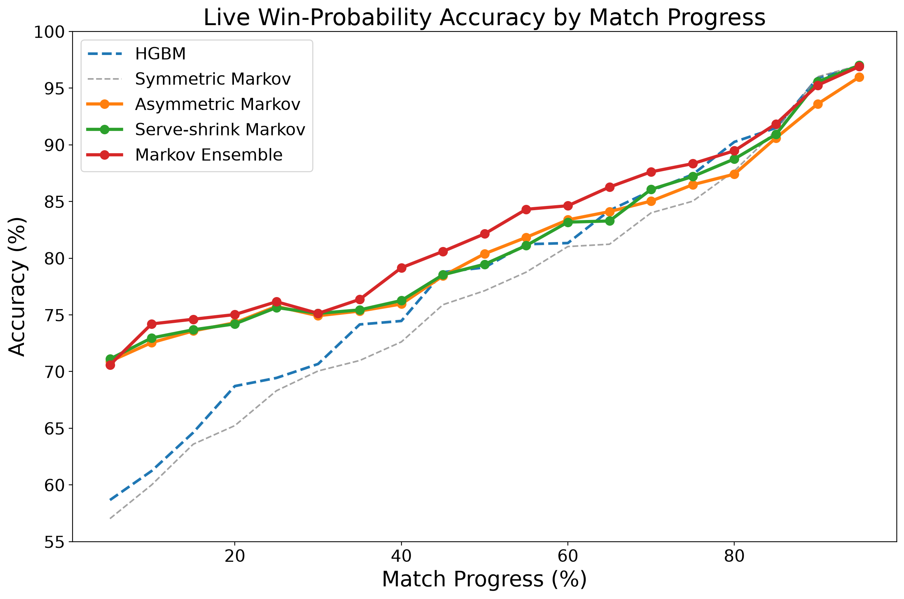

<h1 align="center">Forecasting the Winner of a Live Tennis Match</h1>

<p align="center">
  <a href="mailto:charlesxie157@gmail.com">Charles Xie</a><sup>1</sup> &nbsp;&middot;&nbsp;
  <a href="https://aneeshers.github.io">Aneesh Muppidi</a><sup>2</sup>
</p>
<p align="center"><sub><sup>1</sup> Natick High School &nbsp;·&nbsp; <sup>2</sup> University of Oxford</sub></p>

<p align="center">
  <a href="paper.pdf">
    </a>
  &nbsp;
  <a href="https://github.com/JeffSackmann/tennis_slam_pointbypoint">
    </a>
</p>

<p align="center">
  
</p>

> **TL;DR** &mdash; Tennis scoring is a fixed recursive structure, so a live model
> should not have to learn the rules of tennis. We keep an exact
> point&rarr;game&rarr;set&rarr;match **Markov recursion** and use learning only for
> its inputs: pre-match **Elo** sets the serve priors, **Bayesian shrinkage**
> updates them from in-match serving, and a **gradient-boosted residual layer**
> corrects the structural prediction. The stacked ensemble reaches
> **76.1 / 82.2 / 88.3%** accuracy at 25/50/75% match progress with log losses of
> **0.4753 / 0.3530 / 0.2002**, beating every component model.

This is the official code release for the paper. It covers the full pipeline:
building the point-level dataset from raw Grand Slam point-by-point data,
constructing pre-match Elo ratings, the Markov recursion, all five models, and
the calibration analysis.

| Model | What it adds |
|--|--|
| Symmetric Markov | Score state only; one global serve-point probability |
| Elo-asymmetric Markov | Pre-match player strength via an Elo-derived serve edge |
| Serve-shrink Markov | Bayesian shrinkage of the Elo prior toward live serve performance |
| HGBM | Non-structural ML baseline over score + live features |
| **Stacked Markov ensemble** | Gradient-boosted residual on top of the structural predictions |

---

## Repository layout

```
.
├── src/
│   ├── prepare_data.py     # raw Grand Slam PBP -> point-level modeling table
│   ├── live_features.py    # running in-match features (leakage-free)
│   ├── elo.py              # career-adjusted Elo from ATP/WTA match results
│   ├── markov.py           # point -> game -> set -> match recursion
│   └── common.py           # paths, loading, chronological split, metrics
│
├── models/
│   ├── baseline_markov.py       # symmetric Markov baseline
│   ├── asymmetric_markov.py     # Elo-asymmetric Markov
│   ├── serve_shrink_model.py    # serve-shrink Markov
│   ├── baseline_gbm.py          # histogram gradient-boosting baseline
│   ├── markov_ensemble.py       # stacked Markov ensemble (main model)
│   ├── calibration_curve.py     # reliability diagrams + ECE
│   ├── plot_atp_wta_accuracy.py # tour-specific accuracy figure
│   └── year_split_2011_2019_dev2017_test2014.py  # DeepTennis-split control
│
├── images/                 # result plots and CSVs used in the paper
├── paper.tex
└── README.md  (this file)
```

---

## Setup

```bash
python -m venv .venv && source .venv/bin/activate
pip install numpy pandas scikit-learn matplotlib xgboost lightgbm pyarrow
```

### Data

The project builds on Jeff Sackmann's public datasets. Raw data is **not**
committed; place it as follows (paths are overridable with the `TENNIS_DATA`
and `TENNIS_ARTIFACTS` environment variables):

```
data/
├── slam/     # tennis_slam_pointbypoint
├── atp/      # tennis_atp
└── wta/      # tennis_wta
```

Then build the two artifacts every model reads:

```bash
python src/prepare_data.py    # -> artifacts/points.parquet
python src/elo.py             # -> artifacts/elo.parquet
```

`points.parquet` holds one row per pre-point match state (8,222 matches,
1,505,355 states after filtering). Every live feature is computed from points
*completed before* the prediction state, so there is no lookahead leakage.

---

## Reproducing the paper

All scripts are run from the repository root. The match-progress checkpoint is
the `MATCH_FRACTION` constant at the top of each model script (0.25 / 0.50 /
0.75); the chronological split is fixed in `src/common.py` (train 2011–2021,
validate 2022, test 2023–2024).

```bash
python models/baseline_markov.py      # Symmetric Markov row
python models/asymmetric_markov.py    # Elo-asymmetric Markov row
python models/serve_shrink_model.py   # Serve-shrink Markov row
python models/baseline_gbm.py         # HGBM row
python models/markov_ensemble.py      # Markov Ensemble row (main result)
```

Calibration curves and the tour breakdown:

```bash
python models/calibration_curve.py
python models/plot_atp_wta_accuracy.py
```

The non-chronological DeepTennis-comparable control:

```bash
python models/year_split_2011_2019_dev2017_test2014.py
```

### Expected numbers

Test period 2023–2024, evaluated at fixed fractions of match progress.

| Model | 25% acc | 50% acc | 75% acc | All points | 25% LL | 50% LL | 75% LL |
|--|--:|--:|--:|--:|--:|--:|--:|
| Symmetric Markov | 0.6851 | 0.7703 | 0.8544 | 73.21% | 0.6292 | 0.5363 | 0.3498 |
| Elo-asymmetric Markov | 0.7575 | 0.8050 | 0.8648 | 77.56% | 0.5210 | 0.4549 | 0.3096 |
| Serve-shrink Markov | 0.7564 | 0.7946 | 0.8720 | 77.68% | 0.5142 | 0.4266 | 0.2842 |
| HGBM | 0.6944 | 0.7918 | 0.8738 | 73.98% | 0.5376 | 0.3788 | 0.2299 |
| **Stacked Markov ensemble** | **0.7606** | **0.8215** | **0.8834** | **77.84%** | **0.4753** | **0.3530** | **0.2002** |

Log loss is the metric that matters here: accuracy only asks whether the model
is on the correct side of 0.5, while log loss scores the whole probability.
Saved result tables live in `images/` (`model_accuracy.csv`,
`markov_ensemble_live_features_accuracy.csv`, `calibration_summary.csv`,
`calibration_bins.csv`, `atp_wta_match_fraction_accuracy.csv`).

---

## Method

The recursion is exact. With `p1` and `p2` the two players' serve-point win
probabilities, the probability that player 1 wins the next point is `p1` when
serving and `1 - p2` when receiving, and game/set/match probabilities follow
from the official scoring rules (two-point margins, server alternation,
tiebreaks). This reduces the statistical problem to estimating `p1` and `p2`.

* **Elo prior.** Career-adjusted Elo (all players start at 1500, update factor
  `K = 250 / (m + 5)^0.4` declining with match experience). The rating gap is
  mapped to a clipped serve-probability edge.
* **Serve-shrink update.** The prior is blended with the live serve rate,
  `p = (n·r + κ·π) / (n + κ)`, so an early 9-of-10 stretch does not swing the
  estimate before the sample supports it. `κ` is tuned on validation log loss.
* **Residual layer.** A `HistGradientBoostingClassifier` takes the two
  structural predictions plus score-state and live features and outputs the
  final probability.

---

## Caveats & known limitations

* Player strength is compressed into serve-point probabilities; return strength
  is not modeled separately, and nothing varies by surface.
* Fatigue, injury, weather, handedness, playing style, and tactics are absent,
  and only implicitly visible through live performance.
* Elo linking depends on standardized player-name joins and covers 96.0% of
  matches; the remainder falls out of the Elo-conditioned models.
* The 2011–2019 DeepTennis-split table is a **non-chronological** control and is
  reported only for comparability — it is subject to look-ahead bias and should
  not be read as a clean result.
* Model scripts evaluate at fixed match fractions rather than at every point.

---

## Citation

```bibtex
@misc{xie2026livetennis,
  title  = {Forecasting the Winner of a Live Tennis Match},
  author = {Xie, Charles and Muppidi, Aneesh},
  year   = {2026},
  note   = {Preprint},
  howpublished = {\url{https://github.com/cx-57/live-tennis-research}}
}
```

## Acknowledgments

This project uses the public tennis datasets maintained by
[Jeff Sackmann](https://github.com/JeffSackmann): Grand Slam point-by-point
data and ATP/WTA tour-level match results.
